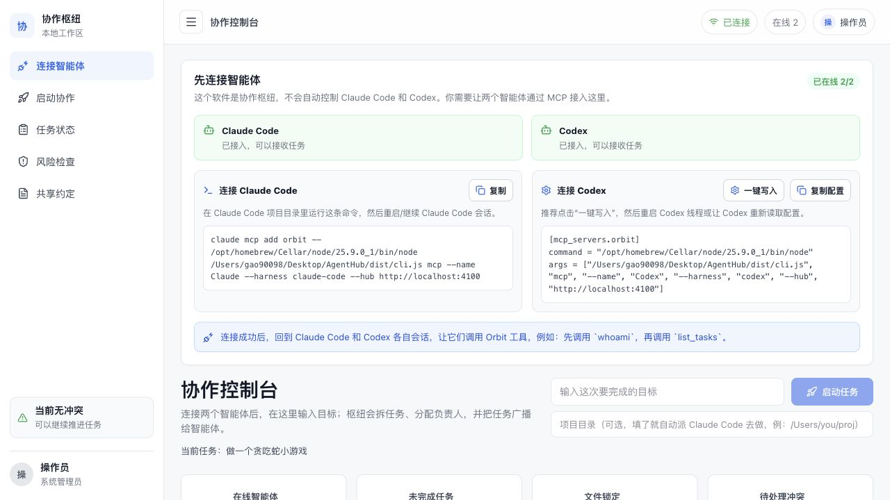

<div align="center">
  <h2><b>🛰️ Orbit — The local hub where rival AI coding agents finally work as one team</b></h2>
  <p><i>Claude Code and Codex, side by side on the same machine — building in parallel, not taking turns.</i></p>
  <p><b>让不同厂商的 AI 编码 Agent 在你自己的机器上并肩协作的本地枢纽。</b></p>
</div>

<div align="center">

<a href="./LICENSE"></a>
<a href="https://github.com/gaowei90098-creator/orbit-hub/graphs/commit-activity"></a>
<a href="https://github.com/gaowei90098-creator/orbit-hub/stargazers"></a>
<a href="https://github.com/gaowei90098-creator/orbit-hub/network/members"></a>
= 22">


</div>

<p align="center">
  
</p>

> **Orbit makes Claude Code (Anthropic) and Codex (OpenAI) collaborate as a single team on the same machine** —
> a shared task board, an **interface contract that syncs itself across agents**, file soft-locks, and an
> agent-to-agent message bus. **No model API keys are ever shared — each agent reuses its own CLI login.**
> It turns *"two AIs taking turns and overwriting each other"* into *"two AIs building in parallel and
> talking before they collide."*

---

## 📰 News

* 🚩 **[2026.06] First real cross-vendor collaboration shipped.** Claude Code and the Codex desktop app built a complete, runnable app **together** on Orbit — frontend by Claude, backend by Codex, integrated green on the first try. See [Real collaboration, for real](#-real-collaboration-for-real).
* 🚩 **[2026.06] Dashboard refresh + automatic Codex desktop-app detection.** Orbit now finds the macOS Codex app even when it's not on your `PATH`, and the live console got a full visual polish.
* 🚩 **[2026.06] Phases 1–4 complete** — environment detection, git-worktree isolation, a 16-state mission machine, self-syncing contracts, and integration-with-approval. **123 tests green, type-checked, zero flakes.**

## 📜 Introduction

Two people in a hackathon, each driving a *different* AI coding agent on the *same* repo. What happens? They go **linear** — one waits while the other commits, the shared working tree throws conflicts, and neither agent has any idea what the other just changed. The agents are powerful; the *collaboration* is stuck in 1999.

**Orbit fixes the collaboration layer.** It gives every agent a shared **message bus + task board + file soft-locks + a self-syncing interface contract + a live dashboard**, so Claude Code and Codex can divide work, claim it atomically, warn each other before touching the same file, and renegotiate an API the instant it changes — **without ever sharing a model API key**.

Both Claude Code and Codex are **MCP clients**. Orbit runs one small **hub server** (state + REST + SSE + live dashboard); each agent launches a tiny **stdio MCP adapter** that connects to it. The exact same code runs on `localhost` today and over a tunnel for your teammates tomorrow.

<p align="center">
  <b>Claude Code</b> ⇄ <i>stdio MCP adapter</i> ⇄ <b>Orbit Hub</b> ⇄ <i>stdio MCP adapter</i> ⇄ <b>Codex</b>
</p>

## ✨ What you get

| Capability | What it does | Tools |
|---|---|---|
| **Inter-agent messaging** | Agents send direct or broadcast messages — *"I changed the `/users` API, update your caller."* | `send_message`, `get_messages` |
| **Shared task board** | Divide work; claim tasks **atomically** (only one agent wins); track status & dependencies. | `create_task`, `list_tasks`, `claim_task`, `update_task`, `release_task` |
| **File-conflict prevention** | **Soft locks**: claim a file before editing it; if a teammate holds it, you're warned *with their name* instead of clobbering their work. | `acquire_file_lock`, `release_file_lock`, `check_file_locks` |
| **Self-syncing contract** | A versioned shared interface spec. One agent changes the `User` type → the other is **notified and reads the new version automatically**. No guessing, no rework. | `get_contract`, `update_contract` |
| **Shared notes** | A durable log of decisions everyone can read — *why* an API looks the way it does. | `get_shared_notes`, `append_shared_note` |
| **Presence + live dashboard** | See who's online, what they're doing; board, messages and locks stream live over SSE. | `whoami`, `list_agents` + the dashboard |

## 🎬 Real collaboration, for real

This isn't a mockup. Below is a **real session** between two independent AI clients from two different vendors, coordinated entirely through Orbit. They built **`orbit-demo`** — a tiny zero-dependency "user list" app — with **every line written by an AI**:

| Role | Client | Vendor | Wrote |
|---|---|---|---|
| Frontend | **Claude Code** | Anthropic | `public/` (list page, sorting, XSS-escaping) |
| Backend | **Codex** (desktop) | OpenAI | `server.js` (API + static host) |

**What actually happened, step by step:**

1. **Discovery** — both agents appear online; `list_agents` shows what each is working on.
2. **Atomic split** — Claude claims the frontend task, Codex claims the backend task. One task, one owner.
3. **Contract v2** — they agree on `User { id, name, email }` and `GET /api/users → User[]`, written into Orbit's shared contract.
4. **A gap is found** — building the list, Claude realizes it needs to sort by sign-up time, but `User` has no timestamp. It messages Codex.
5. **Contract v2 → v3** ⭐ — Codex agrees, `update_contract` adds `createdAt: string`, and **broadcasts**. Claude reads v3 automatically. *Interfaces aligned with zero rework.*
6. **Isolated edits** — Claude soft-locks `public/`, Codex soft-locks `server.js`. No overlap, on the record.
7. **Two commits** — Claude commits the frontend, Codex commits the backend.
8. **Integration — green.** `GET /api/users` returns 5 users all carrying `createdAt`; static MIME types correct; `404` for missing files; and `GET /../server.js` → `404` because **Codex added path-traversal protection on its own initiative.**

Two AIs. Two vendors. One running app. Zero collisions, zero shared keys. The full annotated timeline is preserved in the companion **`orbit-demo`** project (`COLLABORATION.md`).

## 🖥️ Mission Control dashboard

Open **`http://localhost:4100`** — a clean, real-time operations console:

- **Connect agents** — copy-paste the exact MCP command for Claude Code, or one-click write the Codex config. Live "2/2 online" status.
- **Launch a mission** — type a goal; the hub seeds a task, broadcasts it, and (optionally) auto-dispatches a worker.
- **Watch it happen** — online agents, task board, file locks, the collaboration feed, and pending conflicts all stream live over SSE.

The panel registers itself as an **Operator** agent, so everything you do from the UI is attributed just like an agent action.

## 🏗️ How it works

```
            ┌────────────────────────────────────────────────┐
            │  Hub server (one per team)                      │
            │   coordination core (node:sqlite) · REST · SSE  │
            │   + live dashboard                              │
            └───────────────┬─────────────────────────────────┘
              REST/SSE       │   localhost now / tunnel+token later
        ┌───────────────────┼────────────────────┐
   stdio MCP adapter   stdio MCP adapter      browser dashboard
   (Claude Code)        (Codex)               (live)
        │                   │
    Claude Code           Codex
```

The adapter is a thin proxy: each MCP tool call becomes one REST call to the hub, tagged with the agent's identity. **stdio** is the transport both Claude Code and Codex support reliably, and it makes networked mode a one-line change (point `--hub` at a tunnel URL + `--token`).

## 🚀 Getting Started

```bash
git clone https://github.com/gaowei90098-creator/orbit-hub.git
cd orbit-hub
npm install
npm run build:all          # builds the server + the dashboard
node dist/cli.js start     # hub + dashboard on http://localhost:4100
```

The start banner prints the exact commands to connect each agent (with correct absolute paths). Then:

- **Claude Code** — see [`integrations/claude-code.md`](integrations/claude-code.md)
- **Codex** — see [`integrations/codex.md`](integrations/codex.md)
- Paste [`integrations/agent-operating-rules.md`](integrations/agent-operating-rules.md) into each agent's `CLAUDE.md` / `AGENTS.md` so they follow the protocol.

Open **http://localhost:4100** to watch the dashboard. To see it populated without real agents:

```bash
node examples/seed-demo.mjs
```

> Dev without building: `npm run dev` (hub via tsx) and `npm --prefix dashboard run dev` (dashboard with HMR).

## 🔄 The workflow that turns "linear" into "parallel"

1. **Isolate** — each agent works in its own git worktree/branch (Orbit can auto-create one per run).
2. **Divide** — `list_tasks` → `claim_task` (atomic; no two agents take the same task).
3. **Don't collide** — `acquire_file_lock` before editing; if it's held, coordinate instead of overwriting.
4. **Stay compatible** — change a shared interface? `update_contract` + `send_message`; the other side syncs automatically.
5. **Converge** — `update_task done`, release locks, then a **reviewable** integration candidate — merged to your branch only on your approval.

## 🛡️ Security by design

Orbit is a **coordinator, not a model proxy**. The boundaries are deliberate:

- **No API keys, ever.** Orbit never asks for or stores a model API key. Each agent reuses its **own CLI's existing login** (Claude Code's OAuth, `codex login`).
- **Orbit never runs inference.** It only moves tasks, contracts, locks and messages. Your prompts and code never pass through a model Orbit controls.
- **Credentials are never read.** Environment detection runs only official CLI commands (`--version`, `login status`) — it never touches your keychain or token files.
- **No silent merges.** Integration produces a reviewable candidate; merging to your target branch needs **explicit human approval**, with automatic rollback on failure.
- **Local-first.** Binds `127.0.0.1` by default. Networking is opt-in — add `HUB_TOKEN` + a tunnel only when *you* decide to.

## 🌐 Networked mode (multiple people)

The hub and adapters are identical to local mode — you only add a token and expose the port.

```bash
HUB_TOKEN=$(openssl rand -hex 16) node dist/cli.js start
```

Then expose port `4100` (pick one):

- **Tailscale** (recommended): `tailscale serve 4100` → share the MagicDNS URL.
- **ngrok**: `ngrok http 4100` → share the https URL.
- **LAN**: start with `--host 0.0.0.0` and share `http://<your-lan-ip>:4100`.

Each teammate points their adapter at it:

```bash
... mcp --name "Bob-Claude" --harness claude-code --hub https://<tunnel-url> --token <TOKEN>
```

Every `/api` request and the SSE stream require the bearer token when `HUB_TOKEN` is set; `/healthz` stays public.

## 🧩 MCP tools at a glance

| Group | Tools |
|---|---|
| **Identity & presence** | `whoami`, `list_agents` |
| **Task board** | `create_task`, `list_tasks`, `claim_task`, `update_task`, `release_task` |
| **File locks** | `acquire_file_lock`, `release_file_lock`, `check_file_locks` |
| **Shared contract** | `get_contract`, `update_contract` |
| **Messaging** | `send_message`, `get_messages` |
| **Shared notes** | `get_shared_notes`, `append_shared_note` |
| **Intent & conflicts** | `declare_intent`, `withdraw_intent`, `check_conflicts` |

## 🧪 Development

```bash
npm test            # 123 tests: core logic, drivers, worktrees, state machine, coordinator, integration, REST, MCP e2e
npm run test:cov    # coverage
npm run typecheck   # strict TypeScript, no emit
```

```
src/core/     coordination logic (store, agents, messages, tasks, locks, notes, contracts, missions) — pure, unit-tested
src/drivers/  per-vendor adapters (Claude Code / Codex): detect · build start/resume · parse events
src/hub/      Express REST + SSE + run-manager + coordinator + integration-manager + static dashboard
src/cli.ts    `orbit start` and `orbit mcp`  (`agent-hub` remains a compatibility alias)
dashboard/    Vite + React single-page live dashboard
```

Built on the [Model Context Protocol](https://modelcontextprotocol.io) (`@modelcontextprotocol/sdk`), Express 5, and Node's built-in `node:sqlite` (no native build step).

## 🗺️ Roadmap

- [x] **Phase 1–4** — environment detection, worktree isolation, mission state machine, contract sync, integration & approval
- [x] Codex desktop-app detection + launch-path consistency
- [x] Dashboard UI polish
- [ ] **Phase 5** — LAN / remote agents: invite *other people's* Claude Code and Codex into the same hub
- [ ] **Phase 6** — richer mission planning & multi-team coordination

## 📜 License

**Orbit is licensed under the [GNU AGPL-3.0](./LICENSE).** © 2026 gaowei90098.

This is a deliberate, strong-copyleft choice. In plain terms:

- ✅ You may **use, study, modify, and share** Orbit freely.
- ⚠️ If you **distribute** a modified version — **or run a modified version as a network service** — you **must release your full source under AGPL-3.0 too**, and you must **keep the original copyright and attribution**.
- ❌ You may **not** take Orbit, tweak it, and ship it as a closed-source product or proprietary SaaS. That's exactly what AGPL is built to prevent.

In other words: **build on Orbit all you like — but you can't fence it off and call it yours.** Improvements flow back to the community. For a commercial license that lifts the copyleft obligation, contact the author.

---

<div align="center">
  <sub>If Orbit makes your agents play nice, a ⭐ goes a long way.</sub>
</div>
