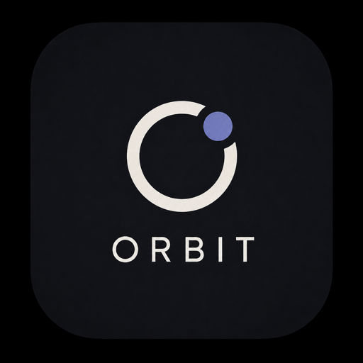

# Orbit

> 主 Agent 协作工作区 - Main-Agent Orchestrated Collaboration Workspace



Orbit 是基于 `hycailxy/AgentHub` 改造的多 Agent 项目协作桌面应用。它不是普通多模型聊天壳，而是由 Orbit 主 Agent 接收项目目标，读取项目上下文和 Memory，生成协作流程，再派发给 Codex CLI、Claude Code、Marvis、MiniMax Code 等子 Agent 执行，最后监督、验证、汇总和返工。

当前源码工作区：`/Users/gao90098/Desktop/AgentForge-MissionControl`

## 核心特性

- **Orbit 主 Agent 编排**：先生成 `PlanArtifact / TaskDAG / TaskContract`，确认后再派发给子 Agent。
- **工作区隔离**：侧栏按工作区分组，每个项目拥有独立对话、任务历史和上下文。
- **新对话历史**：像 Codex 一样从侧栏新建对话，并在不同工作区下整理会话。
- **本地 CLI 优先**：Codex CLI / Claude Code 默认使用本机登录态直连；Provider API 是可选能力。
- **分层 Memory**：短期任务上下文、情节记忆、语义/流程记忆共同帮助 Orbit 延续项目判断。
- **用户远程桥**：Hermes / OpenClaw 用于通知用户、远程要求和确认回传，不默认接代码或数据库写入任务。
- **Provider 与模型绑定**：内置 OpenAI / Anthropic / Gemini / DeepSeek / MiniMax / OpenRouter 等，也支持自定义中转并手动填写 Model ID，避免中转站不支持 `/models` 时路由失败。
- **Supervisor**：规则优先判断真卡住、等队友、验证失败或需要返工；必要时可调用轻量 LLM。

## 快速开始

1. 打开 `/Users/gao90098/Desktop/Orbit.app`。
2. 进入 **设置 → 工作区**，为每个项目添加一个根目录。
3. 进入 **设置 → Provider**，给 Orbit 主 Agent 配置可用模型；Codex / Claude 子 Agent 可用 StdIO 连接本机会员登录态。
4. 在侧栏点击 **新对话**，确认当前工作区后输入项目目标。
5. 在会话功能菜单中选择 **编排**，让 Orbit 生成协作流程，确认后再启动子 Agent。

## 自定义 Provider

创建自定义中转时必须填写：

- `Base URL`：例如 `https://api.example.com/v1`
- `API Key`：可以稍后补
- `Model ID`：必须与中转站支持的模型名称完全一致，例如 `gpt-4o`、`deepseek-chat`、`claude-sonnet-4-6`、`gemini-2.5-flash`

如果中转站不支持 `/models`，可以在 Provider 卡片中手动添加模型名称。

## 本地开发

```bash
cd /Users/gao90098/Desktop/AgentForge-MissionControl
npm install
npm run dev
```

## 验证与打包

```bash
npm run typecheck
npm test
npm run build
npm run unpack
```

## 协议

Orbit 目前沿用 `agenthub:` 深链协议以保持兼容：

- `agenthub://open?workspace=<id>`：打开指定工作区
- `agenthub://chat?agent=<id>`：直接打开与指定 Agent 的会话

## 许可

本项目基于 MIT 许可证开源，详见 LICENSE。
