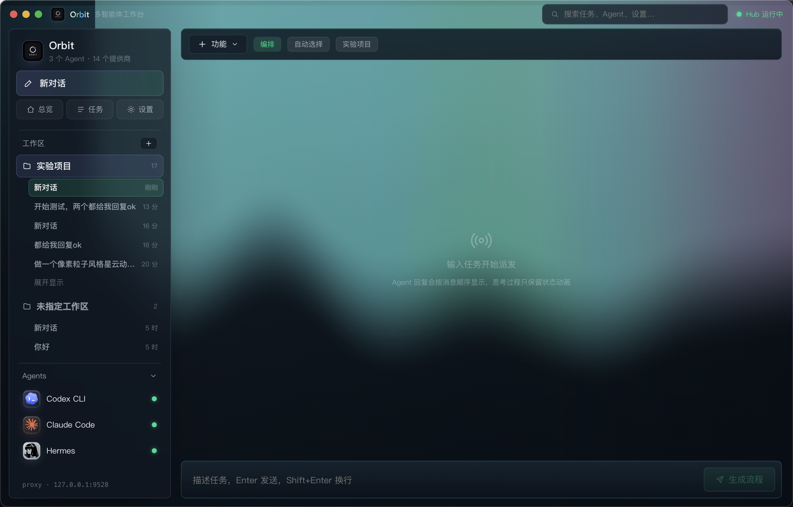

<div align="center">
  <h2><b>🛰️ Orbit — Mission control for a team of AI coding agents</b></h2>
  <p><i>Give one project goal to a main Agent. It plans the work, dispatches your CLI agents, supervises them, verifies the output, and hands you the result — all from one desktop app.</i></p>
  <p><b>主 Agent 编排的多 Agent 协作桌面台 —— 你给一个目标，它来拆解、派发、监督、验证、汇总。</b></p>
</div>

<div align="center">

<a href="./LICENSE"></a>
<a href="https://github.com/gaowei90098-creator/orbit-hub/graphs/commit-activity"></a>
<a href="https://github.com/gaowei90098-creator/orbit-hub/stargazers"></a>
<a href="https://github.com/gaowei90098-creator/orbit-hub/network/members"></a>


<a href="https://github.com/gaowei90098-creator/orbit-hub/actions/workflows/ci.yml"></a>


</div>

<p align="center">
  
</p>

> **Orbit is not another multi-model chat window.** It is a **main Agent** that takes a project
> goal, reads your project context and layered memory, decomposes it into a DAG of bounded
> **task contracts**, dispatches them to local CLI workers (Codex CLI, Claude Code, …), supervises
> the run, verifies the output, and synthesizes the final result. **Your workers run on their own
> CLI logins — so no model API keys are ever shared.** It turns *"copy-pasting between AI chat
> windows and babysitting two terminals"* into *"hand off one goal and review one result."*

---

## 📜 What is Orbit

AI coding agents have gotten genuinely good — but you still drive them **one prompt at a time**. You open Codex in one terminal, Claude Code in another, paste context back and forth, re-explain the project every session, and stitch the pieces together yourself. The agents are state-of-the-art; the *orchestration* around them is still manual labor.

**Orbit is the orchestration layer that sits above your agents.** It is a desktop app (Electron + a React "glass" UI) whose centerpiece is a **main Agent** — codename `orbit`. You give it a project goal; it reads your project context and layered memory, plans a **task DAG of bounded contracts**, asks you to approve the plan, then dispatches each contract to a worker agent running in a local workspace. A **Supervisor** watches for blockers, drives verification and rework, and the main Agent synthesizes the final acceptance.

The main Agent never writes code itself — it **plans, routes, supervises, and synthesizes**. The actual editing is done by vendor-neutral workers (Codex CLI, Claude Code, Marvis, MiniMax Code), preferably over their **local CLI login** so your subscription does the work and no keys are shared.

> Orbit evolved from [`hycailxy/AgentHub`](https://github.com/hycailxy/AgentHub) (working codename *AgentForge Mission Control*). The pivot is deliberate: **from a multi-model chat shell into a main-Agent orchestrator.**

## 💡 Why it matters

Orbit turns the everyday failure modes of "driving AI agents by hand" into wins:

| Driving agents by hand | With Orbit |
|---|---|
| You **copy-paste** context between chat windows and terminals | One goal in → Orbit **plans, dispatches, supervises, synthesizes** |
| Each agent **forgets the project** between runs | **Layered memory** carries context, decisions and lessons across missions |
| Vague *"go build X"* prompts **drift** from what you meant | Bounded **task contracts**: `fileScope`, `doneWhen`, `verifyCommand`, `interfaceRef` |
| You only discover failures **at the end** | A **Supervisor** catches stuck / blocked / verify-failed work **mid-flight** |
| You're **locked into one vendor's** agent | **Vendor-neutral** workers on their **own CLI logins** — no shared API keys |

The payoff is the boring-but-valuable thing: **less prompt-babysitting, fewer dropped threads, and a plan you approve before anything touches your files.**

## 🧠 The core loop

1. **Goal** — you describe a project goal in a workspace-scoped conversation.
2. **Context** — the main Agent reads project context and layered memory (STM + LTM).
3. **Plan** — it emits a `PlanArtifact` / **task DAG** of bounded **task contracts** (title, detail, `fileScope`, `doneWhen`, `verifyCommand`, `interfaceRef`).
4. **Approve** — nothing runs until you approve the plan. ✋
5. **Dispatch** — workers claim or receive contracts and execute in local workspaces.
6. **Coordinate & supervise** — shared state keeps task ownership, file scope, interface contracts, messages and outcomes aligned; the Supervisor distinguishes *truly stuck* vs *waiting* vs *verify-failed* vs *needs-rework* and asks for rescue/rework.
7. **Synthesize** — the main Agent verifies and produces the final acceptance summary.

## ✨ What you get

| Capability | What it does |
|---|---|
| **Main-Agent orchestration** | Reads context + memory and emits a `PlanArtifact` / task DAG of bounded contracts — which you approve before anything runs. |
| **Bounded task contracts** | Every subtask ships with `title`, `detail`, `fileScope`, `doneWhen`, `verifyCommand`, and `interfaceRef` — no more vague hand-offs. |
| **Workspace isolation** | The sidebar groups by workspace; each project keeps its own conversations, task history, and context. |
| **Local-CLI-first workers** | Codex CLI & Claude Code run on your existing CLI login over **StdIO**; a Provider API is optional, not the primary path. |
| **Layered memory** | STM (active mission) · Episodic (past outcomes, failures, repairs, lessons) · Semantic/Procedure (conventions, capabilities, rules, decisions). |
| **Supervisor loop** | Rule-first detection of *stuck / waiting / verify-failed / needs-rework*, with rescue, rework, and a final verification gate. |
| **ACP integration** | An [Agent Client Protocol](https://agentclientprotocol.com) (JSON-RPC over stdio) adapter unifies extra agents — structured tool / file / thinking activity out of the box. |
| **Write/exec approval gating** | Per-agent × per-tool `allow / ask / deny` for file writes and command execution; read-only tools are never gated. |
| **Cross-agent skills** | Install skills per-agent or collectively; they're injected into the system prompt at dispatch. |
| **Provider & model binding** | OpenAI, Anthropic, Gemini, DeepSeek, MiniMax, OpenRouter and more — plus custom relays with a manually entered Model ID. |

## 🎭 Who does what

Roles are deliberate — **don't blur them**:

| Role | Who | Responsibility |
|---|---|---|
| **Main Agent** | `orbit` (HTTP / Provider) | Plan · route · supervise · synthesize. **Never edits code itself.** |
| **Execution workers** | Codex CLI · Claude Code · Marvis · MiniMax Code | Claim/receive contracts and execute in local workspaces (local CLI **StdIO** preferred). |
| **Notification bridges** | Hermes · OpenClaw | Notify you and relay remote requests / approvals — **not** execution workers. |

## 🏗️ How it works

```
        ┌──────────────────────────────────────────────────────────────┐
        │   Orbit.app  ·  Electron + React glass UI                     │
        │                                                                │
        │   project goal ─►  Main Agent (orbit)                          │
        │                       │   reads context + layered memory       │
        │                       ▼                                        │
        │                  orchestrator ─► PlanArtifact / Task DAG        │
        │                       │   bounded task contracts               │
        │              you approve the plan  ✋                          │
        │                       ▼                                        │
        │                   dispatcher ───┬─ StdIO ─► Codex CLI           │
        │                       ▲         ├─ StdIO ─► Claude Code         │
        │                   supervisor    ├─ ACP  ──► Marvis / MiniMax    │
        │              verify · rescue ·  └─ bridge ► Hermes / OpenClaw   │
        │                   rework                    (notify only)       │
        │                       │                                        │
        │                       ▼   synthesize final acceptance          │
        └──────────────────────────────────────────────────────────────┘
            Hub  ws://127.0.0.1:9527      ·      Proxy  http://127.0.0.1:9528/v1
```

The app runs a local **Hub** (agent connections, dispatch, collaboration event bus) and an **Anthropic-shaped proxy** so HTTP models can speak a common tool dialect. Both bind to `127.0.0.1` — Orbit is a coordinator on your machine, not a model gateway in the cloud.

## 🖥️ The desktop app

- **Left rail** — workspaces (each project grouped), per-workspace conversation history, and your agents with live online status.
- **Top console** — a `功能` / **Orchestrate** / **Auto-select** toolbar plus the active workspace.
- **Center** — the run timeline: agent replies in order, with thinking kept as a compact status animation.
- **Bottom** — the task box: describe a goal, hit **Generate plan**, approve, and watch it dispatch.
- **Status** — a live *"Hub running"* indicator; the proxy address is shown in the rail.

## 🚀 Getting started

**Use the app**

1. Open **Orbit** (build it below, or open your packaged `Orbit.app`).
2. **Settings → Workspace** — add a root folder for each project.
3. **Settings → Provider** — bind a model to the main Agent (`orbit`). Codex CLI / Claude Code workers connect through their **own local CLI login** over StdIO — no API key required.
4. **New conversation** — pick the workspace, then type your project goal.
5. Choose **Orchestrate** — Orbit drafts a plan of task contracts; **approve it**, then watch the workers execute on the timeline.

**Build from source**

```bash
git clone https://github.com/gaowei90098-creator/orbit-hub.git
cd orbit-hub
npm install
npm run dev            # Electron + Vite, with reload
```

Package a desktop build:

```bash
npm run build:mac      # or build:win / build:linux
```

> **Custom relay?** When adding a custom provider you must set `Base URL`, `API Key`, and a `Model ID` that exactly matches what the relay supports (e.g. `gpt-4o`, `deepseek-chat`, `claude-sonnet-4-6`, `gemini-2.5-flash`). If the relay doesn't expose `/models`, add the model name by hand on the provider card.

## 🧠 Layered memory

Workers keep their **private** execution history. Only what matters is promoted to shared memory, organized in layers so the main Agent keeps its judgement across sessions:

- **STM** — active mission context, the task DAG, current workers, recent decisions, route context.
- **Episodic LTM** — past mission/dispatch outcomes, failures, repairs, verification results, lessons.
- **Semantic / Procedure LTM** — project conventions, agent capabilities, reusable commands, operating rules, architectural decisions.

## 🛡️ Security by design

Orbit is a **coordinator, not a model proxy you hand keys to**. The boundaries are deliberate:

- **No shared API keys.** Workers reuse their own CLI's existing login (Claude Code's OAuth, `codex login`). Orbit never asks you to paste a worker's model key.
- **Plan-approval gate.** Nothing is dispatched until you approve the plan.
- **Write/exec approval.** File writes and command execution pass a per-agent × per-tool `allow / ask / deny` policy; read-only tools are never gated, and worker file access is sandboxed to the workspace (rejecting `..`, absolute-path and symlink escapes).
- **Private by default.** Workers don't share raw chat history; only outcomes, blockers, contract changes, verification results and lessons reach shared memory.
- **Local-first.** The Hub and proxy bind to `127.0.0.1` (`9527` / `9528`).

## 🧩 Providers & agents

- **Built-in providers** — OpenAI, Anthropic, Gemini, DeepSeek, MiniMax, OpenRouter and more, plus custom relays.
- **Workers** — Codex CLI and Claude Code via local StdIO; additional agents (Marvis, MiniMax Code) via ACP.
- **Bridges** — Hermes and OpenClaw for notifications and remote approvals.
- **Deep links** — `agenthub://` is retained for compatibility: `agenthub://open?workspace=<id>` and `agenthub://chat?agent=<id>`.

## 🧪 Development

```
src/main/
  index.ts            Electron main · Hub (ws 9527) + Anthropic-shaped proxy (9528) · PATH prep · memory seeding
  hub/
    orchestrator.ts   main-Agent decomposition → task contracts
    plan-artifact.ts  PlanArtifact / task DAG
    mission-store.ts  mission state
    dispatcher.ts     dispatch contracts to workers · stream activity
    supervisor.ts     blocker detection · rescue · rework · verify
    collaboration-bus.ts   ONM-style event bus (from OpenAgents)
    workspace.ts      per-workspace context + bootstrap files
    adapters/         per-vendor: codex · claude · acp-client · stdio
  agentic/            HTTP-native agentic loop (config · executor · approval)
  skills/             cross-agent skill system
  providers/          manager · presets · client (OpenAI/Anthropic/Gemini/DeepSeek/MiniMax/OpenRouter)
  routing/proxy.ts    Anthropic /v1/messages proxy with tool passthrough
  memory-library.ts   layered memory (STM · episodic · semantic · procedure · decision)
src/renderer/
  screens/            Home · Chat · Tasks · Settings · Skills
  glass/              glass UI components
```

```bash
npm run typecheck     # strict TypeScript, no emit
npm test              # vitest — 155 tests / 28 files
npm run lint          # eslint
npm run build         # electron-vite build → out/
```

Built on Electron 33, React 18, Vite (electron-vite), Tailwind CSS 4, and TypeScript (strict).

## 🗺️ Roadmap

- [x] Main-Agent decomposition → bounded **task contracts** + plan-approval gate
- [x] Local-CLI-first workers (Codex / Claude over StdIO); provider binding + custom relays
- [x] **Layered memory** (STM · episodic · semantic · procedure · decision)
- [x] **ACP** unified adapter, write/exec approval gating, cross-agent skills
- [ ] **Mission Control** UI panel + task claim / soft-lock board
- [ ] Worktree-isolated worker execution
- [ ] Real Supervisor handoff / rescue + project-level final verification gate

## 📜 License

**Orbit is released under the [MIT License](./LICENSE).** © 2026 AgentHub Team.

You may use, modify, and distribute it freely; keep the copyright and license notice.

---

<div align="center">
  <sub>If Orbit makes your agents pull in one direction, a ⭐ goes a long way.</sub>
</div>
